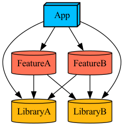

Current CI set up:

Run `BuildAndTest.sh` which does `build-for-testing` for `AllInOneTests` scheme and then `test-without-building`. 
This means that we always run all tests, hence we can't cache any targets because tests of such targets won't build. 

Desired CI set up:

Only build and test modified targets. For current set up:

